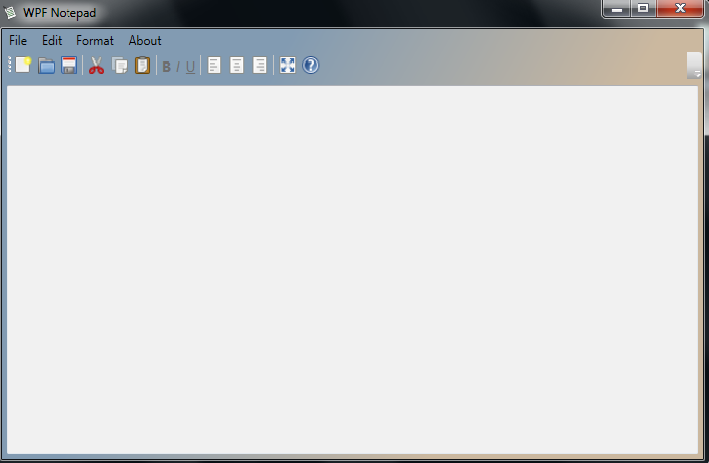

# NotepadWPF

## Description 
This is a Notepad text editor for Windows, reacher than a built-in standard Windows Notepad

## Used technologies
This app has been made using .NET platforn and C# language. There has been utilized WPF (Windows Presentation Foundation), which is the technology for creating reach and modern User Interfaces.
Additionally, this application has been created in accordance with MVVM (Model - View - ViewModel) design pattern.

## Application screen

[[https://github.com/Marcin90K/NotepadWPF/tree/master/NotepadWPF/Image/Notepad_Screen_1.png|alt=Notepad_Screen_1]]

## Application structure
According to the MVVM the application consists of 3 main layers. They are Model (application data), View (rosponsible for interaction with user) and ViewModel (is a intermediate layer between Model and View). 
There is no code-behind the MainWindow class, so it allows the View to be seperated from rest of layers. To ensure the seperation of layers and accordance with MVVM there are used such mechanisms as Commands and Data Binding.

## Features
This app is a text editor. It allows to execute many activities with text using classic menu items or buttons othe toolbar or convenient key combinations. The user can set a font colors and background colors using dialog boxes.
It is ready to use and can be improve by adding any other features.

